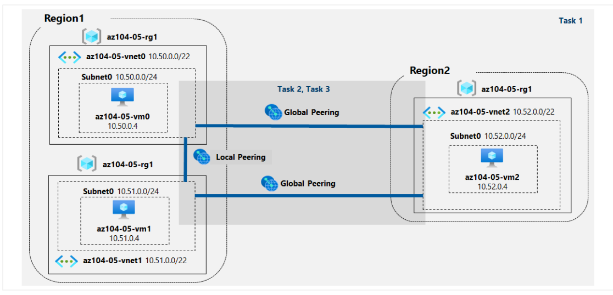
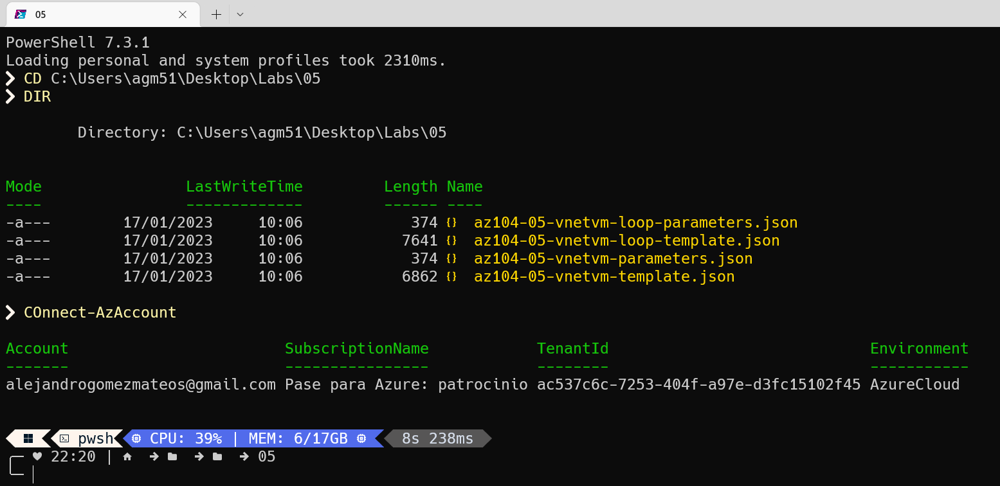
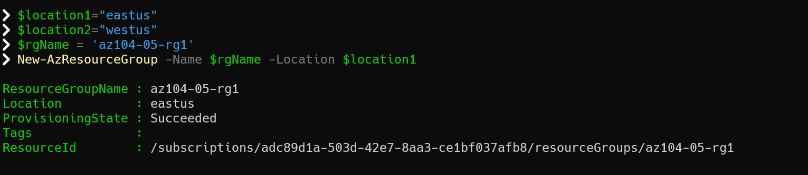
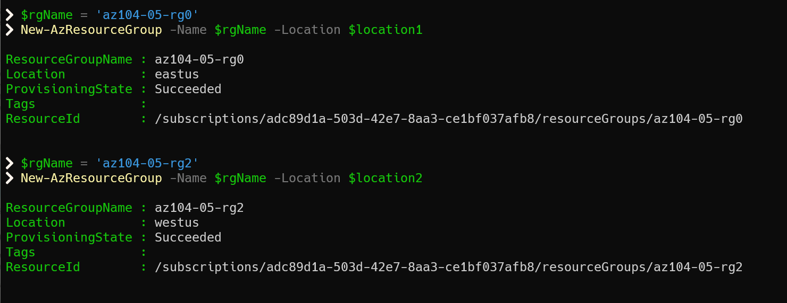
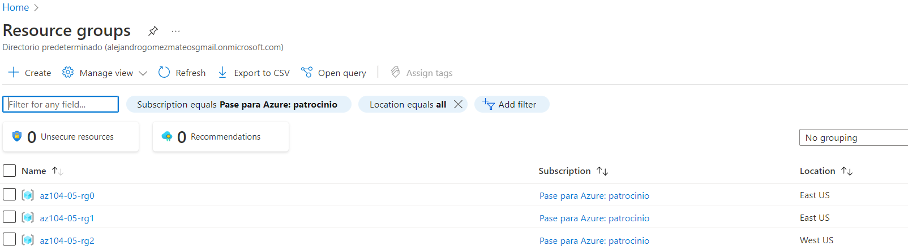
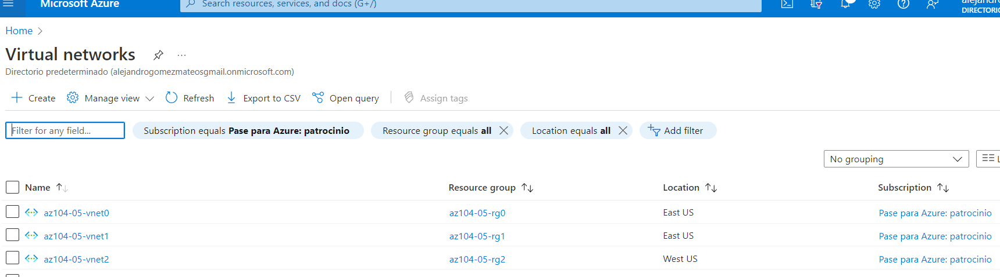
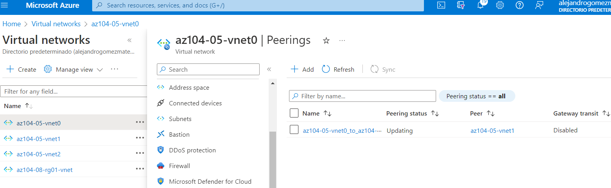
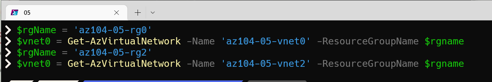
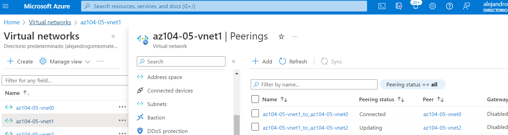
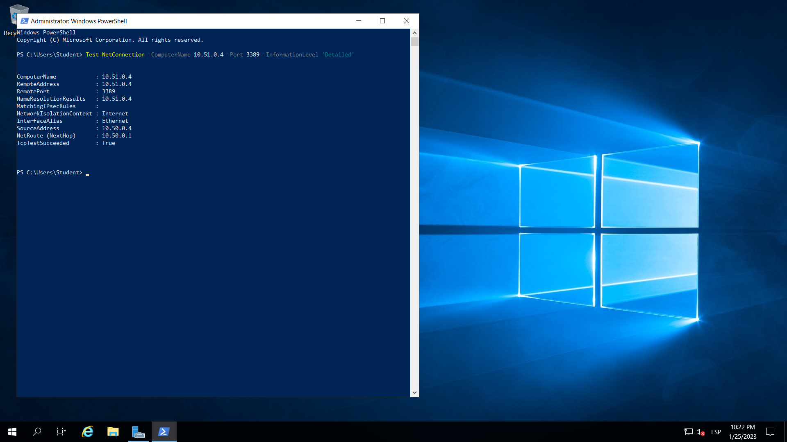

# Laboratorio 05: Implementar la conectividad entre sitios

## Escenario de laboratorio
Contoso tiene sus centros de datos en las oficinas de Boston, Nueva York y Seattle conectados a través de enlaces de red de área amplia en malla, con conectividad total entre ellos. Debe implementar un entorno de laboratorio que refleje la topología de las redes locales de Contoso y verificar su funcionalidad.

**Nota:** Hay disponible una simulación de laboratorio interactiva que le permite hacer clic en este laboratorio a su propio ritmo. Es posible que encuentre ligeras diferencias entre la simulación interactiva y el laboratorio alojado, pero los conceptos e ideas centrales que se demuestran son los mismos.

## Objetivos
En este laboratorio, usted:

- Tarea 1: Aprovisionar el entorno de laboratorio
- Tarea 2: configurar el emparejamiento de redes virtuales locales y globales
- Tarea 3: probar la conectividad entre sitios

## Tiempo estimado: 30 minutos

## Diagrama de arquitectura



## Instrucciones
### Tarea 1: Aprovisionar el entorno de laboratorio
En esta tarea, implementará tres máquinas virtuales, cada una en una red virtual independiente, dos de ellas en la misma región de Azure y la tercera en otra región de Azure.

1. Inicie sesión en el portal de Azure .

2. En Azure Portal, abra Azure Cloud Shell haciendo clic en el icono en la parte superior derecha de Azure Portal.

3. Si se le solicita que seleccione Bash o PowerShell , seleccione PowerShell .



**Nota :** si es la primera vez que inicia Cloud Shell y aparece el mensaje No tiene almacenamiento montado , seleccione la suscripción que está usando en este laboratorio y haga clic en Crear almacenamiento .

4. En la barra de herramientas del panel de Cloud Shell, haga clic en el ícono Cargar/Descargar archivos , en el menú desplegable, haga clic en Cargar y cargue los archivos \Allfiles\Labs\05\az104-05-vnetvm-loop-template.json y \ Allfiles\Labs\05\az104-05-vnetvm-loop-parameters.json en el directorio principal de Cloud Shell.

5. Edite el archivo de parámetros que acaba de cargar y cambie la contraseña. Si necesita ayuda para editar el archivo en el Shell, solicite ayuda a su instructor. Como práctica recomendada, los secretos, como las contraseñas, deben almacenarse de forma más segura en Key Vault.

6. Desde el panel de Cloud Shell, ejecute lo siguiente para crear el grupo de recursos que hospedará el entorno de laboratorio. Las dos primeras redes virtuales y un par de máquinas virtuales se implementarán en [Azure_region_1]. La tercera red virtual y la tercera máquina virtual se implementarán en el mismo grupo de recursos pero en otro [Azure_region_2]. (reemplace el marcador de posición [Azure_region_1] y [Azure_region_2], incluidos los corchetes, con los nombres de dos regiones de Azure diferentes donde pretende implementar estas máquinas virtuales de Azure. Un ejemplo es $ubicación1 = 'eastus'. Puede usar Get- AzLocation para enumerar todas las ubicaciones):

```
$location1 = 'eastus'

$location2 = 'westus'

$rgName = 'az104-05-rg1'

New-AzResourceGroup -Name $rgName -Location $location1
```


**Nota :** Las regiones utilizadas anteriormente se probaron y se sabía que funcionaban cuando este laboratorio se revisó oficialmente por última vez. Si prefiere usar ubicaciones diferentes, o si ya no funcionan, deberá identificar dos regiones diferentes en las que se puedan implementar las máquinas virtuales D2Sv3 estándar.

Para identificar las regiones de Azure, desde una sesión de PowerShell en Cloud Shell, ejecute ```(Get-AzLocation).Location```

Una vez que haya identificado dos regiones que le gustaría usar, ejecute el siguiente comando en Cloud Shell para cada región para confirmar que puede implementar máquinas virtuales estándar D2Sv3.

```
az vm list-skus --location <Replace with your location> -o table --query "[? contains(name,'Standard_D2s')].name"
```

Si el comando no devuelve resultados, debe elegir otra región. Una vez que haya identificado dos regiones adecuadas, puede ajustar las regiones en el bloque de código anterior.

7. Desde el panel de Cloud Shell, ejecute lo siguiente para crear las tres redes virtuales e implementar máquinas virtuales en ellas usando la plantilla y los archivos de parámetros que cargó:

```
New-AzResourceGroupDeployment `
   -ResourceGroupName $rgName `
   -TemplateFile $HOME/az104-05-vnetvm-loop-template.json `
   -TemplateParameterFile $HOME/az104-05-vnetvm-loop-parameters.json `
   -location1 $location1 `
   -location2 $location2
```
**Nota :** Espere a que se complete la implementación antes de continuar con el siguiente paso. Esto debería tomar alrededor de 2 minutos.




8. Cierre el panel de Cloud Shell.

### Tarea 2: configurar el emparejamiento de redes virtuales locales y globales
En esta tarea, configurará el emparejamiento local y global entre las redes virtuales que implementó en las tareas anteriores.

1. En Azure Portal, busque y seleccione Redes virtuales .

2. Revise las redes virtuales que creó en la tarea anterior y verifique que las dos primeras estén ubicadas en la misma región de Azure y la tercera en una región de Azure diferente.

**Nota :** la plantilla que usó para la implementación de las tres redes virtuales garantiza que los intervalos de direcciones IP de las tres redes virtuales no se superpongan.

3. En la lista de redes virtuales, haga clic en az104-05-vnet0 .

4. En la hoja de red virtual az104-05-vnet0 , en la sección Configuración , haga clic en Emparejamientos y luego haga clic en + Agregar .

5. Agregue un emparejamiento con la siguiente configuración (deje los demás con sus valores predeterminados) y haga clic en Agregar :

| Configuración |	Valor |
| -- | -- |
| Esta red virtual: nombre del enlace de emparejamiento | az104-05-vnet0_to_az104-05-vnet1 |
| Esta red virtual: tráfico a la red virtual remota |	Permitir (predeterminado) |
| Esta red virtual: tráfico reenviado desde una red virtual remota | Bloquear el tráfico que se origina fuera de esta red virtual |
| Puerta de enlace de red virtual |	Ninguno |
| Red virtual remota: nombre del enlace de emparejamiento |	az104-05-vnet1_to_az104-05-vnet0 |
| Modelo de implementación de red virtual | Administrador de recursos |
| Sé mi ID de recurso |	no seleccionado |
| Suscripción | el nombre de la suscripción de Azure que está utilizando en este laboratorio |
| red virtual | az104-05-vnet1 |
| Tráfico a la red virtual remota |	Permitir (predeterminado) |
|Tráfico reenviado desde una red virtual remota	| Bloquear el tráfico que se origina fuera de esta red virtual |
| Puerta de enlace de red virtual |	Ninguno |
| | |

**Nota :** este paso establece dos emparejamientos locales: uno de az104-05-vnet0 a az104-05-vnet1 y el otro de az104-05-vnet1 a az104-05-vnet0.

**Nota :** en caso de que tenga un problema con la interfaz de Azure Portal que no muestra las redes virtuales creadas en la tarea anterior, puede configurar el emparejamiento ejecutando los siguientes comandos de PowerShell desde Cloud Shell:

```
$rgName = 'az104-05-rg1'

$vnet0 = Get-AzVirtualNetwork -Name 'az104-05-vnet0' -ResourceGroupName $rgname

$vnet1 = Get-AzVirtualNetwork -Name 'az104-05-vnet1' -ResourceGroupName $rgname

Add-AzVirtualNetworkPeering -Name 'az104-05-vnet0_to_az104-05-vnet1' -VirtualNetwork $vnet0 -RemoteVirtualNetworkId $vnet1.Id

Add-AzVirtualNetworkPeering -Name 'az104-05-vnet1_to_az104-05-vnet0' -VirtualNetwork $vnet1 -RemoteVirtualNetworkId $vnet0.Id
```


6. En la hoja de red virtual az104-05-vnet0 , en la sección Configuración , haga clic en Emparejamientos y luego haga clic en + Agregar .

7. Agregue un emparejamiento con la siguiente configuración (deje los demás con sus valores predeterminados) y haga clic en Agregar :

| Configuración |	Valor |
| -- | -- |
| Esta red virtual: nombre del enlace de emparejamiento | az104-05-vnet0_to_az104-05-vnet2 |
| Esta red virtual: tráfico a la red virtual remota |	Permitir (predeterminado) |
| Esta red virtual: tráfico reenviado desde una red virtual remota |	Bloquear el tráfico que se origina fuera de esta red virtual |
| Puerta de enlace de red virtual |	Ninguno |
| Red virtual remota: nombre del enlace de emparejamiento |	az104-05-vnet2_to_az104-05-vnet0 |
| Modelo de implementación de red virtual	| Administrador de recursos |
| Sé mi ID de recurso |	no seleccionado |
| Suscripción | el nombre de la suscripción de Azure que está utilizando en este laboratorio |
| red virtual | az104-05-vnet2 |
| Tráfico a la red virtual remota |	Permitir (predeterminado) |
| Tráfico reenviado desde una red virtual remota | Bloquear el tráfico que se origina fuera de esta red virtual |
| Puerta de enlace de red virtual |	Ninguno |
| | |



**Nota :** este paso establece dos emparejamientos globales: uno de az104-05-vnet0 a az104-05-vnet2 y el otro de az104-05-vnet2 a az104-05-vnet0.

**Nota :** en caso de que tenga un problema con la interfaz de Azure Portal que no muestra las redes virtuales creadas en la tarea anterior, puede configurar el emparejamiento ejecutando los siguientes comandos de PowerShell desde Cloud Shell:

```
$rgName = 'az104-05-rg1'

$vnet0 = Get-AzVirtualNetwork -Name 'az104-05-vnet0' -ResourceGroupName $rgname

$vnet2 = Get-AzVirtualNetwork -Name 'az104-05-vnet2' -ResourceGroupName $rgname

Add-AzVirtualNetworkPeering -Name 'az104-05-vnet0_to_az104-05-vnet2' -VirtualNetwork $vnet0 -RemoteVirtualNetworkId $vnet2.Id

Add-AzVirtualNetworkPeering -Name 'az104-05-vnet2_to_az104-05-vnet0' -VirtualNetwork $vnet2 -RemoteVirtualNetworkId $vnet0.Id
```



8. Vuelva a la hoja Redes virtuales y, en la lista de redes virtuales, haga clic en az104-05-vnet1 .

9. En la hoja de red virtual az104-05-vnet1 , en la sección Configuración , haga clic en Emparejamientos y luego haga clic en + Agregar .

10. Agregue un emparejamiento con la siguiente configuración (deje los demás con sus valores predeterminados) y haga clic en Agregar :

| Configuración |	Valor |
| -- | -- |
| Esta red virtual: nombre del enlace de emparejamiento | az104-05-vnet1_to_az104-05-vnet2 |
| Esta red virtual: tráfico a la red virtual remota |	Permitir (predeterminado) |
|Esta red virtual: tráfico reenviado desde una red virtual remota	| Bloquear el tráfico que se origina fuera de esta red virtual |
| Puerta de enlace de red virtual |	Ninguno |
| Red virtual remota: nombre del enlace de emparejamiento |	az104-05-vnet2_to_az104-05-vnet1 |
| Modelo de implementación de red virtual | Administrador de recursos |
| Sé mi ID de recurso |	no seleccionado |
| Suscripción | el nombre de la suscripción de Azure que está utilizando en este laboratorio |
| red virtual | az104-05-vnet2 |
| Tráfico a la red virtual remota |	Permitir (predeterminado) |
| Tráfico reenviado desde una red virtual remota |	Bloquear el tráfico que se origina fuera de esta red virtual |
| Puerta de enlace de red virtual |	Ninguno |
| | |



**Nota :** este paso establece dos emparejamientos globales: uno de az104-05-vnet1 a az104-05-vnet2 y el otro de az104-05-vnet2 a az104-05-vnet1.

**Nota :** en caso de que tenga un problema con la interfaz de Azure Portal que no muestra las redes virtuales creadas en la tarea anterior, puede configurar el emparejamiento ejecutando los siguientes comandos de PowerShell desde Cloud Shell:

```
$rgName = 'az104-05-rg1'

$vnet1 = Get-AzVirtualNetwork -Name 'az104-05-vnet1' -ResourceGroupName $rgname

$vnet2 = Get-AzVirtualNetwork -Name 'az104-05-vnet2' -ResourceGroupName $rgname

Add-AzVirtualNetworkPeering -Name 'az104-05-vnet1_to_az104-05-vnet2' -VirtualNetwork $vnet1 -RemoteVirtualNetworkId $vnet2.Id

Add-AzVirtualNetworkPeering -Name 'az104-05-vnet2_to_az104-05-vnet1' -VirtualNetwork $vnet2 -RemoteVirtualNetworkId $vn
```
